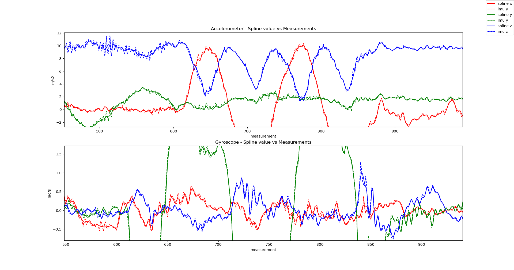

# Example: Visual-Inertial Calibration of a GoPro 9 Camera
For this example I am using a GoPro 9. To calibrate the camera and the IMU to camera transformation we will use the following script: **python/run_gopro_calibration.py** 

0. Get the test data from here: [link](https://drive.google.com/file/d/1XjtUX-4ZI0Ydkd2O3BWnaUzfmzm96He4/view?usp=share_link). Then you can skip step 1. & 2. 

1. Data acquisition

   1.1 Print out the target: resource/board.png to a paper and attach it to something rigid (e.g. a wall). Measure the size of a black square in meter (e.g. 0.021m).
   
   1.2 Now record **3** videos.

   1.2.1 The first is to calibrate the camera.
        Move **SLOWLY** around the board. We do not want motion blur or the rolling shutter to influence the result. Record for about 20-30s. --> e.g. GH0000.MP4

   1.2.2 Place the GoPro on the floor or on a table and press record. Leave it there for 10-20s without touching it. This video will be used to estimate the current IMU bias. We assume it to be fixed during the calibration. --> e.g. GH0001.MP4

   1.2.3 Finally record the last video. Again record the board and make sure that you have good lighting conditions. If possible set the shutter time of your GoPro the minimum (e.g. 1/480). If the board is barely visible your lighting condition is not good enough. Having a very fast shutter assures crisp corners and less motion blur. Also it should improve RS line delay calibration. --> e.g. GH0002.MP4
   - Excite all 3 axis -> 3 translation and 3 rotation.
   - Move fast, but not too fast (motion blur). 
   - Make sure that most of the board is visible

2. Create the following folder structure:

```
MyDataset
|-- cam
|     |-- GH0000.MP4
|   imu_bias
|     |-- GH0001.MP4
|   cam_imu
|     |-- GH0002.MP4
```

3. Run the calibration
Only use the PINHOLE model whenever you do not expect any distortion (e.g. smartphone or GoPro in Linear mode)!
``` python
python python/run_gopro_calibration.py --path_calib_dataset=/your/path/MyDataset --checker_size_m=0.021 --image_downsample_factor=2 --camera_model=DIVISION_UNDISTORTION
```
Also check out all the other parameters you can set!

4. The spline calibration in the end should converge smoothly after 8-15 iterations. If not, your recordings are probably not good enough to perform a decent calibration. Also have a look at the final spline fit to the IMU readings:


