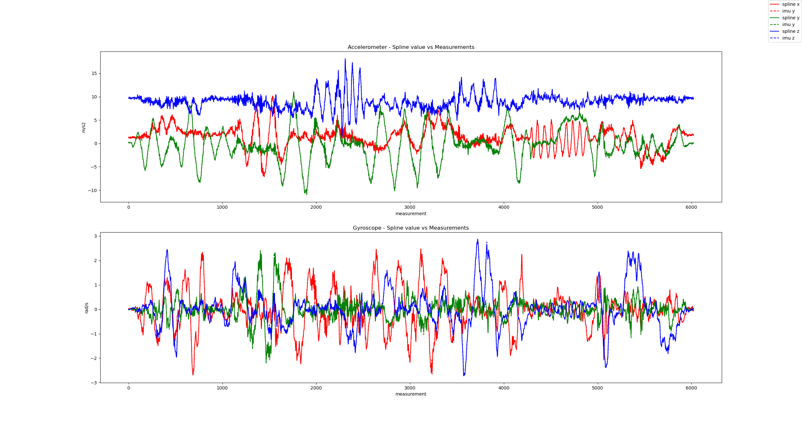

# Example: Visual-Inertial Calibration of a Samsung S20FE
For this example I am using a Samsung S20FE. To calibrate the camera and the IMU to camera transformation we will use the following script: **python/run_smartphone_calibration.py**.


0. Get the test data from here: [link](https://drive.google.com/file/d/1XB3xh2inJkf_29NZ8TQIDkJkPMsYz00M/view?usp=sharing). Then you can skip step 1. & 2. 

1. Data acquisition

   1.1 Print out the target: resource/board.png to a paper and attach it to something rigid (e.g. a wall or floor). Measure the size of a black square in meter (e.g. 0.021m).
   
   1.2 Install the app [Pilotguru](https://play.google.com/store/apps/details?id=ru.pilotguru.recorder&gl=DE) on your phone. 

   1.3 Now record **3** videos. I selected the 720p setting.

   1.3.1 The first is to calibrate the camera.
        Move **SLOWLY** around the board. We do not want motion blur or the rolling shutter to influence the result. Record for about 20-30s.

   1.3.2 Place the smartphone on the floor or on a table and press record. Leave it there for 10-20s without touching it. This video will be used to estimate the current IMU bias. We assume it to be fixed during the calibration. 

   1.3.3 Finally record the last video. Again record the board and make sure that you have good lighting conditions. 
   - Excite all 3 axis -> 3 translation and 3 rotation.
   - Move fast, but not too fast (motion blur). 
   - Make sure that most of the board is visible

2. Create the following folder structure:

```
MyS20Dataset
|-- cam
|     |-- video.mp4
|     |-- frames/rotations/pressures/can_frames/gps_status/locations.json
|   imu_bias
|     |-- video.mp4
|     |-- frames/rotations/pressures/can_frames/gps_status/locations.json
|   cam_imu
|     |-- video.mp4
|     |-- frames/rotations/pressures/can_frames/gps_status/locations.json
```

3. Run the calibration
Only use the PINHOLE model whenever you do not expect any distortion. Additionally, for the example dataset I will fix the gravity direction, as I known that the board was flat on the floor.
``` python
python python/run_smartphone_calibration.py --path_calib_dataset=/your/path/MyS20Dataset --checker_size_m=0.021 --image_downsample_factor=1 --camera_model=PINHOLE --known_gravity_axis=Z
```
Also check out all the other parameters you can set!

4. The spline calibration in the end should converge smoothly after 4-8 iterations. If not, your recordings are probably not good enough to perform a decent calibration. Also have a look at the final spline fit to the IMU readings:


